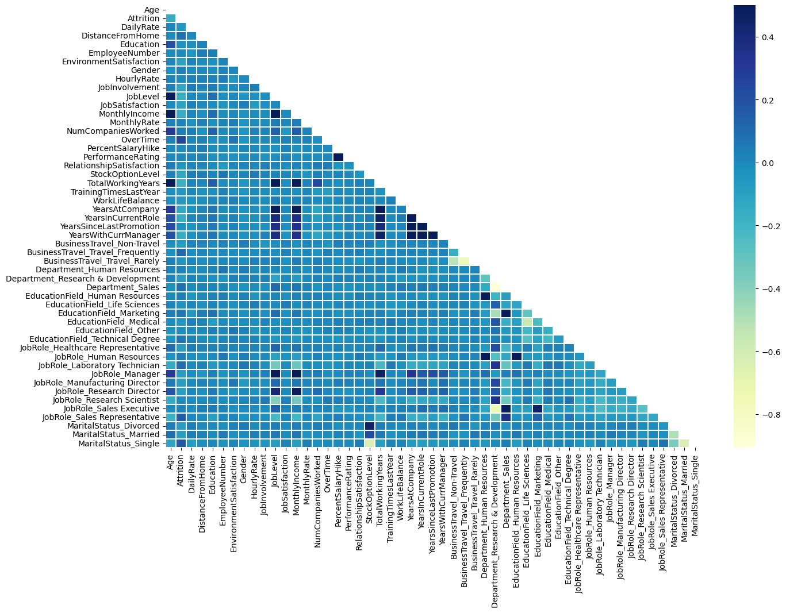
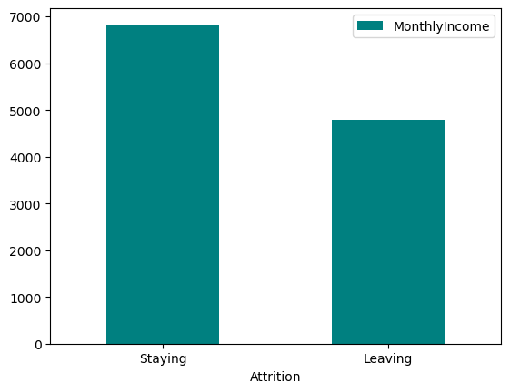

# Employee Attrition Analysis and Prediction

## Project Overview

This project aims to analyze employee attrition data and build predictive models to understand the factors leading to employee turnover. The analysis includes exploratory data analysis (EDA), visualization of key trends, and the development of classification models to predict whether an employee will leave the company.

## Dataset Description

The dataset used in this project is the **IBM HR Analytics Employee Attrition & Performance** dataset, which contains various features related to employee demographics, job roles, satisfaction levels, and attrition status. Key features include:

- `Age`
- `MonthlyIncome`
- `JobSatisfaction`
- `Attrition`
- And many more.

## Project Structure

- **EDA.ipynb**: Contains the exploratory data analysis and visualizations.
- **Classification_Models.ipynb**: Contains the implementation of various classification models to predict employee attrition.

## Methodology

### 1. Exploratory Data Analysis (EDA)

The EDA focuses on understanding the distribution of features and their relationships with the target variable (`Attrition`). Key steps include:

- **Missing Data Analysis**: Identification and handling of missing data.
- **Feature Distribution**: Visualization of distributions for numerical and categorical features.
- **Correlation Analysis**: Analysis of feature correlations with a heatmap.
- **Correlation Heatmap**:

### 2. Predictive Modeling

Several machine learning models were developed and evaluated to predict employee attrition:

- **Logistic Regression**
- **Decision Tree**
- **Random Forest**
- **XGBoost**

The models were evaluated based on metrics such as accuracy, precision, recall, F1-score, and ROC AUC.

## Key Findings

### Monthly Income, Daily Rate, Monthly Rate and Attrition
- Employees who left the company generally had lower average monthly incomes compared to those who stayed.
  - **Average Monthly Income of Employees Leaving**: `4787.09`
  - **Average Monthly Income of Employees Staying**: `6832.74`
- Visualization:
  

### Strong correlations were observed between `MonthlyIncome` and `JobLevel`, as well as between `TotalWorkingYears` and `Age`.

### Model Performance
- The tuned **Logistic Regression** model provided the best performance, with a ROC AUC score of **0.815**, indicating a strong ability to distinguish between employees who are likely to leave and those who will stay. Moreover, the **Random Forest** model while not that behind with ROC AUC score of **0.794**, provided explainability and importances of certain attributes that are strong indicators of attrition.

### Neural Networks
Additionally tested Artificial Neural Networks as Classifiers for this task, experimented with a variety of activation functions such as `ReLU`, `Swish`, `ELU`, `leaky ReLU` and found `Leaky ReLU` to be the best performing in this network of 4 hidden layers.
The ANN had a ROC AUC Score of **0.846**, this outperforms the Logistic Regression Model and the Random Forest

